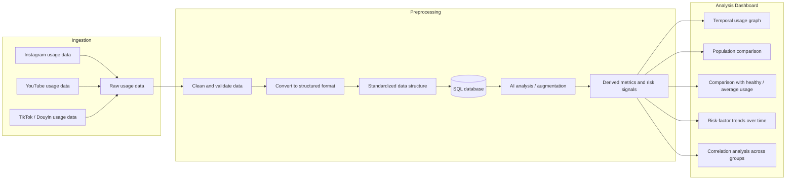

# LDiHK

## Technical Diagram

```mermaid
flowchart LR
  subgraph Ingestion["Ingestion"]
    IG["Instagram usage data"]
    YT["YouTube usage data"]
    TT["TikTok / Douyin usage data"]
    RAW["Raw usage data"]
    IG --> RAW
    YT --> RAW
    TT --> RAW
  end

  subgraph Preprocessing["Preprocessing"]
    direction TB

    CLEAN["Clean and validate data"] --> STRUCTURE["Convert to structured format"] --> STANDARD["Standardized data structure"]
    STANDARD --> DB[("SQL database")]
    DB --> AI["AI analysis / augmentation"]
    AI --> FEATURES["Derived metrics and risk signals"]
  end

  subgraph Dashboard["Analysis Dashboard"]
    TEMPORAL["Temporal usage graph"]
    POP["Population comparison"]
    HEALTHY["Comparison with healthy / average usage"]
    RISK["Risk-factor trends over time"]
    CORR["Correlation analysis across groups"]
  end

  RAW --> CLEAN
  FEATURES --> TEMPORAL
  FEATURES --> POP
  FEATURES --> HEALTHY
  FEATURES --> RISK
  FEATURES --> CORR
```
