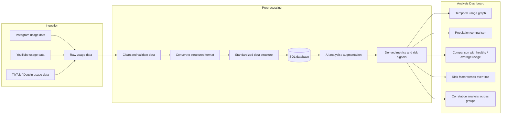

# LDiHK

## Hosted Site

The BUSINESS VIDEO is at:

```text
https://youtube.com/shorts/t1Bc-_SUxZg
```

The website is hosted at:

```text
https://ldihk.xyz/
```

The hosted frontend is configured to use the live Render backend API:

```text
https://ldihk-api.onrender.com
```

Health check:

```text
https://ldihk-api.onrender.com/health
```

The hosted demo runs with the frontend mock API disabled and sends browser API
traffic to the Render service. Local development instructions are below.

## Quick Start

Set up the local Python environment:

```sh
uv venv .venv
uv sync
```

Run the tests:

```sh
uv run python -m unittest discover -s backend/tests
```

Process the local Google Takeout export:

```sh
uv run python backend/scripts/process_youtube_usage.py
```

This writes:

```text
data/processed/users/local_user/youtube_usage.v1.json
```

Build the v3 SQLite usage store:

```sh
uv run python backend/scripts/import_youtube_usage_sql.py
```

This writes:

```text
data/processed/users/local_user/youtube_usage.v3.sqlite
```

Enrich v3 video durations when a YouTube Data API key is configured:

```sh
cp .env.example .env
# Set YOUTUBE_API_KEY in .env
uv run python backend/scripts/enrich_youtube_durations.py
```

Start the read-only API:

```sh
uv run flask --app backend.app run --host 127.0.0.1 --port 8000
```

Available endpoints:

```text
GET http://127.0.0.1:8000/health
GET http://127.0.0.1:8000/api/users/local_user/youtube-usage
GET http://127.0.0.1:8000/api/v2/users/local_user/youtube-usage/temporal
POST http://127.0.0.1:8000/api/v3/query
POST http://127.0.0.1:8000/api/query
POST http://127.0.0.1:8000/api/imports
GET http://127.0.0.1:8000/api/imports/{import_id}
```

If `uv` cannot write to its default cache in a restricted environment, prefix commands with:

```sh
uv --cache-dir .uv-cache ...
```

## Frontend

The pulled frontend lives in `Frontend/`.

```sh
cd Frontend
npm install
cp .env.example .env
npm run dev
```

For the real backend, set:

```sh
PUBLIC_API_URL=http://127.0.0.1:8000
```

For local browser development, the backend CORS allowlist includes Astro's
default origin:

```text
http://localhost:4321
```

Leave `PUBLIC_API_URL` empty to use the frontend's local Astro mock API routes.

## Technical Diagram


