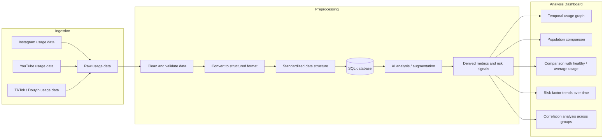

# LDiHK

## Quick Start

Set up the local Python environment:

```sh
uv venv .venv
uv sync
```

Run the tests:

```sh
uv run python -m unittest discover -s backend/tests
```

Process the local Google Takeout export:

```sh
uv run python backend/scripts/process_youtube_usage.py
```

This writes:

```text
data/processed/users/local_user/youtube_usage.v1.json
```

Build the v3 SQLite usage store:

```sh
uv run python backend/scripts/import_youtube_usage_sql.py
```

This writes:

```text
data/processed/users/local_user/youtube_usage.v3.sqlite
```

Enrich v3 video durations when a YouTube Data API key is configured:

```sh
cp .env.example .env
# Set YOUTUBE_API_KEY in .env
uv run python backend/scripts/enrich_youtube_durations.py
```

Start the read-only API:

```sh
uv run flask --app backend.app run
```

Available endpoints:

```text
GET http://127.0.0.1:5000/health
GET http://127.0.0.1:5000/api/users/local_user/youtube-usage
GET http://127.0.0.1:5000/api/v2/users/local_user/youtube-usage/temporal
POST http://127.0.0.1:5000/api/v3/query
```

If `uv` cannot write to its default cache in a restricted environment, prefix commands with:

```sh
uv --cache-dir .uv-cache ...
```

## Technical Diagram


