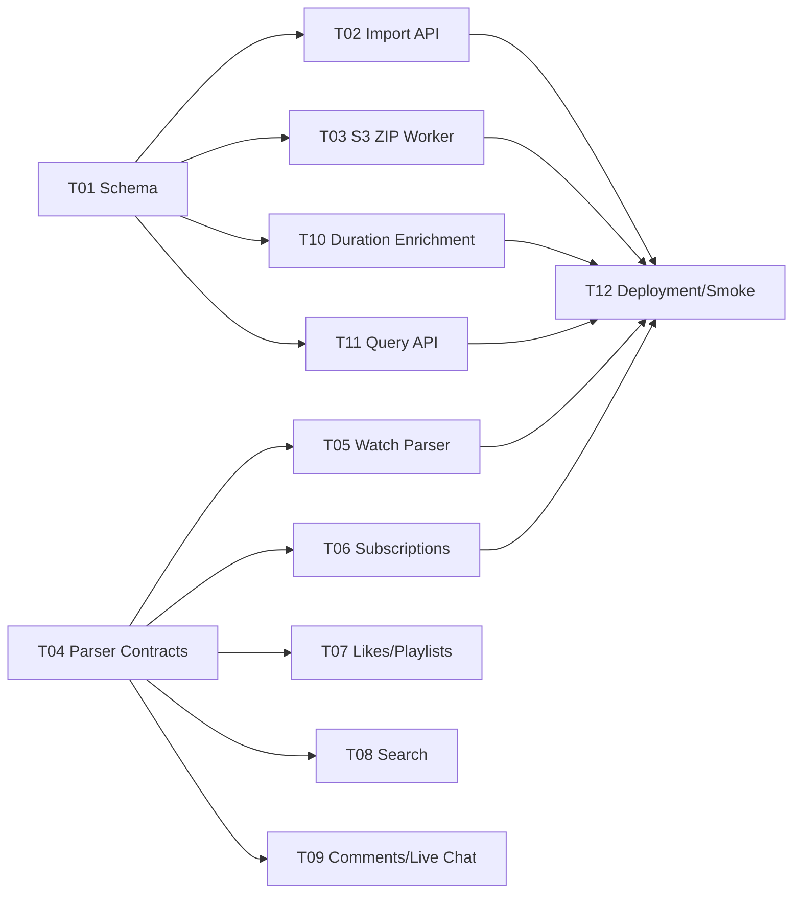

# YouTube Takeout S3/Postgres Tickets

These tickets break the S3/Postgres YouTube Takeout implementation plan into
parallel work packages for separate agents and workspaces.

Source plan:

- `docs/backend/youtube-takeout-s3-postgres-implementation-plan.md`

## Parallelization Rules

- Each agent should claim one ticket file and respect its owned-file guidance.
- Do not refactor unrelated existing backend code while implementing a ticket.
- Use TDD one behavior at a time: RED, GREEN, then refactor.
- Prefer public-interface tests over tests coupled to private helper functions.
- If two tickets need the same interface, use the contracts described here
  rather than inventing incompatible shapes.
- Database schema changes should be concentrated in Ticket 01 unless a later
  ticket explicitly requires a small migration extension.

## Ticket Index

| Ticket | Title | Can Start Immediately | Primary Ownership |
| --- | --- | --- | --- |
| [T01](./T01-postgres-schema-and-db-contract.md) | Postgres schema and DB contract | Yes | migrations, DB helper |
| [T02](./T02-import-job-api.md) | Import job API | After T01 contract | API endpoints |
| [T03](./T03-s3-zip-worker-skeleton.md) | S3 ZIP worker skeleton | After T01 contract | worker, S3, ZIP safety |
| [T04](./T04-parser-dispatch-and-contracts.md) | Parser dispatch and event contracts | Yes | ingestion parser interfaces |
| [T05](./T05-watch-history-parser.md) | Watch history parser | After T04 contract | watch history parser |
| [T06](./T06-subscriptions-parser.md) | Subscriptions parser | After T04 contract | subscriptions parser |
| [T07](./T07-likes-and-playlist-parser.md) | Likes and playlist parser | After T04 contract | likes/watch-later parser |
| [T08](./T08-search-history-parser.md) | Search history parser | After T04 contract | search parser |
| [T09](./T09-comments-and-live-chat-parser.md) | Comments and live chat parser | After T04 contract | comment/live-chat parser |
| [T10](./T10-duration-enrichment-worker.md) | Duration enrichment worker | After T01 contract | enrichment module |
| [T11](./T11-structured-query-api.md) | Structured query API | After T01 contract | query endpoint/compiler |
| [T12](./T12-deployment-and-smoke-tests.md) | Deployment and smoke tests | After T02/T03/T11 basics | Docker, ops docs, smoke tests |

## Dependency Graph



## Shared Interface Contracts

Use these names unless a ticket proves they need to change.

Import status values:

```text
queued
running
completed
failed
```

Core event types:

```text
watch
search
like
comment
live_chat
playlist_add
watch_later_add
subscription_snapshot
```

Parser result shape:

```python
@dataclass(frozen=True)
class ParsedEvent:
    event_type: str
    product: str
    occurred_at: datetime | None
    video_id: str | None = None
    channel_id: str | None = None
    title: str | None = None
    search_query: str | None = None
    raw_status: str | None = None
    native_id: str | None = None
    sequence: int = 0

@dataclass(frozen=True)
class ParsedSubscription:
    channel_id: str
    channel_url: str | None
    channel_title: str | None

@dataclass(frozen=True)
class ParseWarning:
    code: str
    sample: str | None = None

@dataclass(frozen=True)
class ParseResult:
    events: list[ParsedEvent]
    subscriptions: list[ParsedSubscription]
    warnings: list[ParseWarning]
    records_seen: int
```

Structured query endpoint:

```text
POST /api/query
```

Import endpoints:

```text
POST /api/imports
GET /api/imports/{import_id}
```

## TDD Expectations For Every Ticket

Each ticket should include this loop in implementation:

1. RED: write one failing behavior test through the public interface.
2. GREEN: add the smallest implementation that passes.
3. Repeat until acceptance criteria are covered.
4. Refactor only after all tests are green.
5. Run the focused tests for the ticket and, where practical, the full backend
   test suite.

