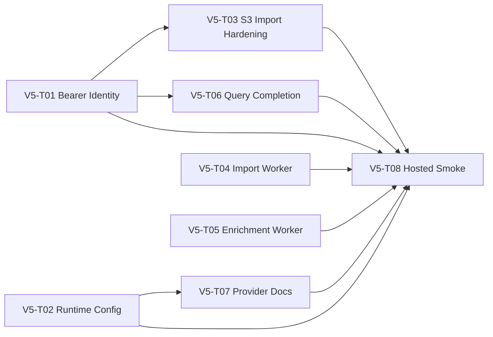

# v5 Hosted Backend Tickets

These tickets break the v5 hosted-backend plan into independently grabbable
work packages for separate agents and workspaces.

Source plans:

- `docs/backend/versions/v5-hosted-backend-workers-and-deployment.md`
- `docs/backend/frontend-api-spec.md`

## Parallelization Rules

- Each agent should claim one ticket file and respect its owned-file guidance.
- Use TDD one behavior at a time: RED, GREEN, then refactor.
- Prefer public-interface tests over tests coupled to private helpers.
- Keep changes scoped to the ticket. Do not refactor unrelated v1-v4 code.
- If two tickets need the same interface, use the contracts in this README and
  the frontend handoff spec rather than inventing incompatible shapes.
- Database schema changes should be concentrated in V5-T05 unless another
  ticket explicitly needs a small migration extension.
- Hosted-provider secrets are not committed. Tests should use fakes, local
  fixtures, or environment-gated live checks.

## Ticket Index

| Ticket | Title | Can Start Immediately | Primary Ownership |
| --- | --- | --- | --- |
| [V5-T01](./V5-T01-bearer-identity-and-cors.md) | Bearer identity and CORS boundary | Yes | API auth/request boundary |
| [V5-T02](./V5-T02-production-runtime-and-config.md) | Production runtime and config | Yes | Docker, env, web runtime |
| [V5-T03](./V5-T03-s3-import-api-hardening.md) | S3 import API hardening | After V5-T01 contract | import API, S3 validation |
| [V5-T04](./V5-T04-import-worker-progress-and-transactions.md) | Import worker progress and transactions | Yes | import worker persistence |
| [V5-T05](./V5-T05-enrichment-jobs-worker.md) | Enrichment jobs worker | Yes | enrichment jobs and worker |
| [V5-T06](./V5-T06-dashboard-query-completion.md) | Dashboard query completion | After V5-T01 contract | query API/compiler |
| [V5-T07](./V5-T07-provider-setup-and-deployment-docs.md) | Provider setup and deployment docs | Yes, HITL for credentials | deployment docs/smoke commands |
| [V5-T08](./V5-T08-hosted-end-to-end-smoke.md) | Hosted end-to-end smoke test | After V5-T01-T07 basics | hosted smoke script |

## Dependency Graph



## Shared Interface Contracts

Public identity:

```text
Authorization: Bearer <LDiHKID>
```

Rules:

- Public identity is `ldihk_id`.
- Internal database schema remains `user_id`.
- User-scoped request bodies must not accept `ldihk_id`, `user_id`, or
  `person_id`.
- Missing/malformed bearer token returns `401`.
- User-owned resources must be scoped by bearer `ldihk_id`.

Import endpoints:

```text
POST /api/imports
GET /api/imports/{import_id}
```

Import request body:

```json
{
  "s3_bucket": "existing-bucket",
  "s3_key": "uploads/demo-user-123/youtube_takeout_2026.zip",
  "s3_etag": "optional-etag"
}
```

Import status values:

```text
queued
running
completed
failed
```

`completed` means ZIP parsing and Postgres persistence completed. It does not
mean duration enrichment completed.

Query endpoint:

```text
POST /api/query
```

Hosted v5 uses the backend metric names:

```text
estimated_watch_seconds
estimated_event_count
quality
```

Do not add `watch_seconds` or `events_missing_duration` aliases unless the user
explicitly changes the contract.

## TDD Expectations For Every Ticket

Each ticket should include this loop in implementation:

1. RED: write one failing behavior test through the public interface.
2. GREEN: add the smallest implementation that passes.
3. Repeat until acceptance criteria are covered.
4. Refactor only after all tests are green.
5. Run the focused tests for the ticket and, where practical, the full backend
   test suite.

Avoid horizontal test writing. Do not write all tests first and then all code.
Work in vertical tracer bullets.

